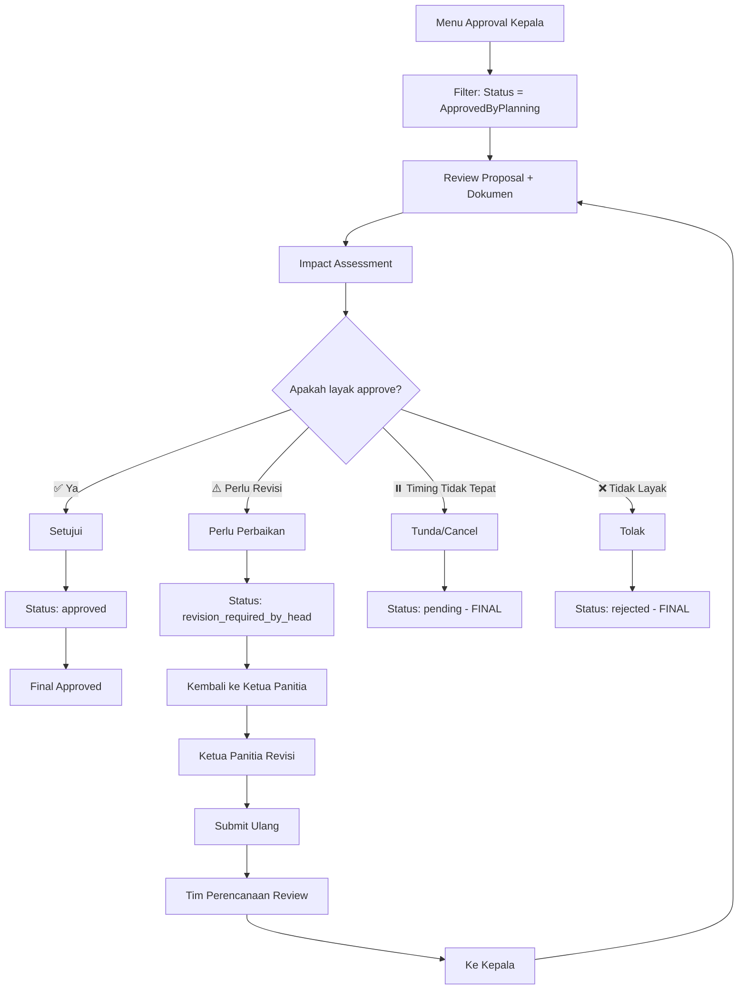

## Role: Kepala

**Akses**: User dengan role `kepala`

**URL**: `/app/approval-kepalas`

---

## Overview

Kepala bertanggung jawab melakukan **approval final** terhadap proposal kegiatan yang sudah disetujui oleh Tim Perencanaan. 

### Tugas Utama:
1. ✅ Review proposal yang sudah approved oleh Tim Perencanaan
2. ✅ Impact Assessment (4 dimensi)
3. ✅ Edit susunan keanggotaan panitia
4. ✅ Decide: Setujui, Perlu Perbaikan, Tunda/Cancel, atau Tolak

---

## 1. Akses Dashboard Approval

### Langkah:
1. Login ke sistem Sinergi
2. Klik menu **Approval Kepala** di dashboard
3. Lihat daftar agenda yang menunggu review

### Filter Status:
- **ApprovedByPlanning**: Menunggu approval Kepala (action required)
- **Approved**: Sudah disetujui Kepala
- **RevisionRequiredByHead**: Dikembalikan untuk perbaikan
- **Pending**: Ditunda/dibatalkan
- **Rejected**: Ditolak

---

## 2. Review Proposal

### Langkah:
1. Klik agenda dengan status **ApprovedByPlanning**
2. Review informasi lengkap di halaman **Info**:
   - Judul kegiatan
   - Tujuan & lokasi
   - Tanggal pelaksanaan
   - Anggota panitia
   - Rencana & realisasi anggaran
   - Klasifikasi program
3. Download dan review dokumen:
   - **Proposal** (desain kegiatan)
   - **Dokumen Telaah** (dari Tim Perencanaan)
   - **KAK & RAB** (dari Tim Perencanaan)
4. Evaluasi kesesuaian dengan visi-misi organisasi

---

## 3. Action Approval

Terdapat **4 aksi** yang dapat dilakukan:

### 3.1 Setujui (Approve) ✅

**Kondisi**: Proposal strategis dan layak dilaksanakan.

**Syarat Wajib**:
- ✅ Impact Assessment (4 dimensi, scale 1-5 ⭐)
- ✅ Isi Catatan Kepala

**Langkah**:
1. Klik tombol **Setujui** di halaman review
2. Modal form akan muncul dengan field Impact Assessment:
   - **Dampak Strategis** ⭐⭐⭐⭐⭐ (1-5 bintang)
   - **Dampak Penerima Manfaat** ⭐⭐⭐⭐⭐ (1-5 bintang)
   - **Konsekuensi jika Agenda Tidak Tercapai** ⭐⭐⭐⭐⭐ (1-5 bintang)
   - **Dampak Lanjutan (Multiplier Effect)** ⭐⭐⭐⭐⭐ (1-5 bintang)
   - **Catatan Kepala** (text area)
3. Pilih rating bintang untuk setiap dimensi
4. Isi catatan kepala (wajib)
5. Klik **Simpan**

**Hasil**:
- Status: `approved_by_planning` → `approved`
- Agenda **disetujui final** dan siap dilaksanakan
- Notifikasi dikirim ke Ketua Panitia dan Tim Perencanaan

**Auto-calculations**:
```
Impact Score = (total_stars / 20) * 100
Impact Star Overall = total_stars / 4
```

**Contoh**:
- Jika semua dimensi dapat 5⭐: total = 20
- Impact Score = (20/20) * 100 = **100**
- Impact Star Overall = 20/4 = **5.00**

---

### 3.2 Perlu Perbaikan (Request Revision) ⚠️

**Kondisi**: Proposal perlu perbaikan substantif.

**Langkah**:
1. Klik tombol **Perlu Perbaikan**
2. Modal form akan muncul
3. Isi **Alasan / Catatan Perbaikan** (wajib)
   - Jelaskan detail yang perlu diperbaiki
   - Berikan arahan yang jelas
4. Klik **Simpan**

**Hasil**:
- Status: `approved_by_planning` → `revision_required_by_head`
- Agenda kembali ke Ketua Panitia untuk direvisi
- Notifikasi dikirim ke Ketua Panitia dengan catatan

**Catatan**:
- Ketua Panitia akan upload proposal revisi dan submit ulang
- Setelah revisi, status kembali ke `submitted`
- Tim Perencanaan harus review ulang

---

### 3.3 Tunda / Cancel ⏸️

**Kondisi**: Agenda perlu ditunda atau dibatalkan karena kondisi tertentu.

**Peringatan**: **Action ini tidak dapat diubah (irreversible)**

**Langkah**:
1. Klik tombol **Tunda / Cancel**
2. Modal konfirmasi muncul
3. Isi **Alasan Penundaan** (wajib)
   - Jelaskan alasan penundaan/pembatalan
4. Klik **Simpan**

**Hasil**:
- Status: `approved_by_planning` → `pending`
- Agenda tidak dapat dilanjutkan
- Notifikasi dikirim ke Ketua Panitia

**Peringatan Keras**:
- ⚠️ Status `pending` bersifat **final**
- ⚠️ Agenda tidak dapat di-approve ulang
- ⚠️ Ketua Panitia harus membuat agenda baru jika ingin mengajukan lagi

---

### 3.4 Tolak (Reject) ❌

**Kondisi**: Agenda tidak strategis/tidak layak dilaksanakan.

**Langkah**:
1. Klik tombol **Tolak**
2. Modal konfirmasi muncul
3. Isi **Alasan Penolakan** (wajib)
   - Jelaskan alasan penolakan secara detail
4. Klik **Tolak**

**Hasil**:
- Status: `approved_by_planning` → `rejected`
- Agenda ditolak final
- Notifikasi dikirim ke Ketua Panitia

**Peringatan**:
- ⚠️ Status `rejected` bersifat **final**
- ⚠️ Agenda tidak dapat diajukan ulang

---

## 4. Impact Assessment

### 4 Dimensi Penilaian:

#### 1. Dampak Strategis ⭐
**Pertanyaan**: Seberapa strategis kegiatan ini terhadap visi-misi organisasi?

| Rating | Kriteria |
|--------|----------|
| ⭐ (1) | Tidak strategis, tidak mendukung visi-misi |
| ⭐⭐ (2) | Kurang strategis, sedikit mendukung visi-misi |
| ⭐⭐⭐ (3) | Cukup strategis, mendukung beberapa aspek visi-misi |
| ⭐⭐⭐⭐ (4) | Strategis, mendukung sebagian besar visi-misi |
| ⭐⭐⭐⭐⭐ (5) | Sangat strategis, core program visi-misi |

#### 2. Dampak Penerima Manfaat ⭐
**Pertanyaan**: Seberapa besar manfaat kegiatan ini bagi penerima manfaat?

| Rating | Kriteria |
|--------|----------|
| ⭐ (1) | Manfaat minimal, penerima sedikit |
| ⭐⭐ (2) | Manfaat kurang, penerima terbatas |
| ⭐⭐⭐ (3) | Manfaat cukup, penerima moderat |
| ⭐⭐⭐⭐ (4) | Manfaat besar, penerima banyak |
| ⭐⭐⭐⭐⭐ (5) | Manfaat sangat besar, penerima sangat banyak |

#### 3. Konsekuensi jika Agenda Tidak Tercapai ⭐
**Pertanyaan**: Seberapa besar dampak negatif jika kegiatan ini tidak dilaksanakan?

| Rating | Kriteria |
|--------|----------|
| ⭐ (1) | Tidak ada konsekuensi |
| ⭐⭐ (2) | Konsekuensi minor |
| ⭐⭐⭐ (3) | Konsekuensi moderat |
| ⭐⭐⭐⭐ (4) | Konsekuensi serius |
| ⭐⭐⭐⭐⭐ (5) | Konsekuensi sangat serius/kritis |

#### 4. Dampak Lanjutan (Multiplier Effect) ⭐
**Pertanyaan**: Seberapa besar dampak lanjutan (multiplier effect) dari kegiatan ini?

| Rating | Kriteria |
|--------|----------|
| ⭐ (1) | Tidak ada dampak lanjutan |
| ⭐⭐ (2) | Dampak lanjutan minimal |
| ⭐⭐⭐ (3) | Dampak lanjutan moderat |
| ⭐⭐⭐⭐ (4) | Dampak lanjutan signifikan |
| ⭐⭐⭐⭐⭐ (5) | Dampak lanjutan sangat besar/berkelanjutan |

### Formula Perhitungan:

```javascript
total_stars = strategis + manfaat + konsekuensi + multiplier
// Max total = 20 (5+5+5+5)

impact_score = (total_stars / 20) * 100
// Max score = 100

impact_star_overall = total_stars / 4
// Max overall = 5.00
```

### Contoh Perhitungan:

**Kegiatan: Workshop Kurikulum Merdeka**

| Dimensi | Rating |
|---------|--------|
| Dampak Strategis | ⭐⭐⭐⭐⭐ (5) |
| Dampak Penerima Manfaat | ⭐⭐⭐⭐ (4) |
| Konsekuensi | ⭐⭐⭐⭐ (4) |
| Multiplier Effect | ⭐⭐⭐⭐⭐ (5) |
| **Total** | **18** |

**Hasil**:
- Impact Score = (18/20) * 100 = **90**
- Impact Star Overall = 18/4 = **4.50** ⭐

---

## 5. Edit Susunan Keanggotaan

**Akses**: Hanya jika `approval_status = approved_by_planning`

**Lokasi**: Tab **Edit Panitia**

### Field yang Dapat Diedit:

| Field | Editable | Keterangan |
|-------|----------|------------|
| **Staf** | ✅ | Pilih staf untuk setiap peran |
| **Peran** | ✅ | Penanggung Jawab, Anggota, dll |
| **Ketua Panitia** | 🔒 | **Tidak dapat diubah** (readonly) |

### Langkah Edit:
1. Buka agenda dengan status **Menunggu Approval Kepala**
2. Klik tab **Edit Panitia**
3. Edit susunan keanggotaan:
   - Tambah anggota baru: **Tambah Anggota**
   - Edit anggota: Update **Staf** atau **Peran**
   - Hapus anggota: Klik **Delete** (kecuali Ketua Panitia)
4. Klik **Simpan**

**Catatan Penting**:
- ⚠️ **Ketua Panitia tidak dapat dihapus atau diubah**
- ✅ Anggota lain dapat ditambah/diedit/dihapus
- ✅ Peran dapat diubah sesuai kebutuhan

---

## 6. Monitoring Agenda

### 6.1 Agenda yang Perlu Approval

**Filter**: Status = `approved_by_planning`

**Action Required**:
- Review proposal & dokumen
- Impact assessment
- Decide: Approve, Revision, Pending, Reject

### 6.2 Agenda Sudah Disetujui

**Filter**: Status = `approved`

**Status**: Kegiatan siap dilaksanakan

**Action**: Monitoring pasif (tidak ada action)

### 6.3 Agenda Perlu Perbaikan

**Filter**: Status = `revision_required_by_head`

**Status**: Dikembalikan ke Ketua Panitia untuk revisi

**Action**: 
- Monitor revisi dari Ketua Panitia
- Review ulang setelah Ketua Panitia submit

### 6.4 Agenda Ditunda/Ditolak

**Filter**: Status = `pending` atau `rejected`

**Status**: Final (tidak dapat diubah)

**Action**: Tidak ada (closed)

---

## 7. Notifikasi

### Notifikasi Dikirim Saat:

| Event | Recipient | Channel |
|-------|-----------|---------|
| Agenda ApprovedByPlanning | Kepala | Telegram/Google Chat |
| Agenda Approved (Kepala) | Ketua Panitia, Tim Perencanaan | Telegram/Google Chat |
| Revision Required by Head | Ketua Panitia | Telegram/Google Chat |
| Agenda Pending | Ketua Panitia | Telegram/Google Chat |
| Agenda Rejected | Ketua Panitia | Telegram/Google Chat |

### Cara Cek Notifikasi:
1. Dashboard → Bell icon
2. Telegram bot
3. Google Chat

---

## 8. Business Rules

### 8.1 Persyaratan Approve

**Wajib**:
- ✅ Impact Assessment (4 dimensi) completed
- ✅ Catatan Kepala diisi
- ✅ Status agenda = `approved_by_planning`

### 8.2 Edit Panitia

**Hanya bisa edit jika**:
- ✅ Status = `approved_by_planning`
- ✅ User role = `kepala`
- ✅ Ketua Panitia tidak dapat diubah

### 8.3 Action Final

**Tidak dapat diubah**:
- ❌ Status `pending` (Tunda/Cancel)
- ❌ Status `rejected` (Tolak)

**Dapat direvisi**:
- ✅ Status `revision_required_by_head` (Ketua Panitia dapat submit ulang)

---

## 9. Workflow Diagram



---

## 10. Troubleshooting

### Problem: Tombol Setujui Tidak Muncul

**Penyebab**:
- ❌ Status bukan `approved_by_planning`
- ❌ Sudah diapprove/rejected/pending

**Solusi**:
1. Cek status agenda
2. Pastikan agenda belum diproses

### Problem: Impact Assessment Tidak Bisa Disimpan

**Penyebab**:
- ❌ Ada dimensi yang belum dipilih ratingnya
- ❌ Catatan Kepala kosong

**Solusi**:
1. Pastikan ke-4 dimensi sudah dipilih (1-5⭐)
2. Isi catatan kepala (wajib)

### Problem: Tidak Bisa Edit Panitia

**Penyebab**:
- ❌ Status bukan `approved_by_planning`
- ❌ Bukan role `kepala`

**Solusi**:
1. Pastikan status = `approved_by_planning`
2. Cek role user

### Problem: Ketua Panitia Tidak Bisa Diedit

**Penyebab**:
- ✅ **Ini adalah fitur, bukan bug**
- Ketua Panitia dikunci untuk menjaga akuntabilitas

**Solusi**:
- Jika perlu ganti ketua, Ketua Panitia harus edit di tahap draft/revisi

---

## 11. Tips & Best Practices

### ✅ DO (Lakukan)
1. **Review impact assessment** dengan teliti
2. **Berikan rating yang objektif** sesuai kriteria
3. **Catatan kepala** yang konstruktif dan jelas
4. **Koordinasi dengan Tim Perencanaan** jika ada pertanyaan
5. **Monitor timeline** approval (jangan terlalu lama)
6. **Edit panitia** jika ada posisi krusial yang kosong

### ❌ DON'T (Jangan)
1. **Jangan approve** tanpa impact assessment yang matang
2. **Jangan berikan rating** tanpa evaluasi yang jelas
3. **Jangan tolak/tunda** tanpa alasan yang kuat
4. **Jangan edit panitia** tanpa koordinasi dengan Ketua Panitia
5. **Jangan tunda approval** terlalu lama (menghambat kegiatan)

---

## 12. Matriks Keputusan

| Kondisi | Action yang Disarankan |
|---------|----------------------|
| **Strategis + Manfaat Besar + Konsekuensi Tinggi** | ✅ Setujui (5⭐, 5⭐, 5⭐, 5⭐) |
| **Strategis + Dokumen Kurang Lengkap** | ⚠️ Perlu Perbaikan |
| **Tidak Strategis + Manfaat Minimal** | ❌ Tolak |
| **Strategis + Anggaran Tidak Tepat** | ⚠️ Perlu Perbaikan (koordinasi Tim Perencanaan) |
| **Strategis + Timing Tidak Tepat** | ⏸️ Tunda/Cancel |
| **Ragu-ragu / Perlu Diskusi** | ⚠️ Perlu Perbaikan (dengan catatan diskusi) |


## 13. Referensi Guide Lain

- [Pengantar Tape Ketan](/sinergi/tape-ketan/intro) - Overview & Workflow
- [Akses Pegawai](/sinergi/tape-ketan/akses-pegawai) - Panduan Pegawai
- [Akses Perencanaan](/sinergi/tape-ketan/akses-perencanaan) - Panduan Tim Perencanaan
- [Akses Kepala](/sinergi/tape-ketan/akses-kepala) - Panduan Kepala
- [Akses Tim SPI](/sinergi/tape-ketan/akses-spi) - Panduan Tim SPI

---

**Changelog**:
- **2026-02-27**: Guide pertama kali dibuat
