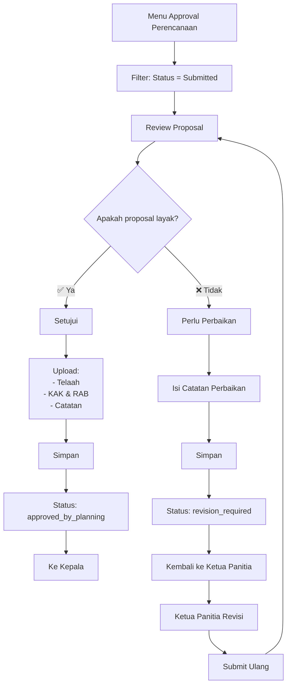

## Role: Tim Perencanaan

**Akses**: User dengan role `tim_perencanaan`

**URL**: `/app/approval-perencanaans`

## Overview

Tim Perencanaan bertanggung jawab melakukan **verifikasi awal** terhadap proposal kegiatan yang diajukan oleh pegawai. 

### Tugas Utama:
1. ✅ Review proposal (desain kegiatan)
2. ✅ Upload Dokumen Telaah
3. ✅ Upload KAK & RAB
4. ✅ Edit anggaran dan klasifikasi program
5. ✅ Decide: Setujui, Perlu Perbaikan, atau Tolak

---

## 1. Akses Dashboard Approval

### Langkah:
1. Login ke sistem Sinergi
2. Klik menu **Approval Perencanaan** di dashboard
3. Lihat daftar agenda yang menunggu review

### Filter Status:
- **Submitted**: Menunggu verifikasi (action required)
- **ApprovedByPlanning**: Sudah disetujui Tim Perencanaan
- **RevisionRequired**: Dikembalikan untuk perbaikan
- **Rejected**: Ditolak

---

## 2. Review Proposal

### Langkah:
1. Klik agenda dengan status **Submitted**
2. Baca informasi kegiatan di halaman **Info**:
   - Judul kegiatan
   - Tujuan & lokasi
   - Tanggal pelaksanaan
   - Jumlah sasaran
   - Anggota panitia
   - Rencana anggaran
3. Download dan review **Dokumen Proposal** (PDF)
4. Evaluasi kesesuaian dengan rencana kerja tahunan

---

## 3. Action Approval

Terdapat 3 aksi yang dapat dilakukan:

### 3.1 Setujui (Approve)

**Kondisi**: Proposal lengkap dan sesuai rencana.

**Syarat Wajib**:
- ✅ Upload Dokumen Telaah (PDF, max 25MB)
- ✅ Upload KAK & RAB (PDF, max 25MB)
- ✅ Isi catatan singkat hasil telaah

**Langkah**:
1. Klik tombol **Setujui** di halaman review
2. Modal form akan muncul dengan field:
   - **Dokumen Telaah**: Upload PDF
   - **Dokumen KAK & RAB**: Upload PDF
   - **Catatan Singkat Hasil Telaah**: Text area
3. Lengkapi semua field wajib
4. Klik **Simpan**

**Hasil**:
- Status: `submitted` → `approved_by_planning`
- Agenda masuk ke dashboard **Kepala** untuk approval 2
- Notifikasi dikirim ke Ketua Panitia dan Kepala

---

### 3.2 Perlu Perbaikan (Request Revision)

**Kondisi**: Proposal perlu perbaikan/revisi.

**Langkah**:
1. Klik tombol **Perlu Perbaikan**
2. Modal form akan muncul
3. Isi **Alasan / Catatan Perbaikan** (wajib)
   - Jelaskan detail yang perlu diperbaiki
   - Berikan saran perbaikan yang jelas
4. Klik **Simpan**

**Hasil**:
- Status: `submitted` → `revision_required`
- Agenda kembali ke Ketua Panitia untuk direvisi
- Notifikasi dikirim ke Ketua Panitia dengan catatan perbaikan

**Catatan**:
- Ketua Panitia akan upload proposal revisi dan submit ulang
- Setelah revisi, status kembali ke `submitted`

---

### 3.3 Tolak (Reject)

**Kondisi**: Proposal tidak layak/tidak sesuai rencana.

**Langkah**:
1. Klik tombol **Tolak**
2. Modal konfirmasi muncul
3. Isi **Alasan Penolakan** (wajib)
   - Jelaskan alasan penolakan secara detail
4. Klik **Tolak**

**Hasil**:
- Status: `submitted` → `rejected`
- Agenda tidak dapat diajukan ulang (final)
- Notifikasi dikirim ke Ketua Panitia

**Peringatan**: 
- Penolakan bersifat final
- Ketua Panitia harus membuat agenda baru jika ingin mengajukan kegiatan

---

## 4. Mengedit Anggaran & Klasifikasi

**Akses**: Hanya jika `approval_status = submitted`

**Lokasi**: Tab **Anggaran**

### Field yang Dapat Diedit:

#### A. Ringkasan Anggaran
| Field | Editable | Keterangan |
|-------|----------|------------|
| **Rencana Anggaran** | ✅ | Nominal anggaran (Rp) |
| **Realisasi Anggaran** | ✅ | Akan diisi tim keuangan |
| **Selisih Anggaran** | 🔒 | Auto-calculated (readonly) |

#### B. Klasifikasi Program
| Field | Editable | Opsi |
|-------|----------|------|
| **Kode Program** | ✅ | Pilih dari aktivitas (filter tahun anggaran) |
| **Klasifikasi** | ✅ | Prioritas, Inovasi, Optimalisasi, Arahan Pusat |
| **Paket Meeting** | ✅ | FullDay, FullBoard, None |
| **Pendanaan** | ✅ | Rupiah Murni, PNBP, Sharing Cost |

### Langkah Edit:
1. Buka agenda dengan status **Menunggu Verifikasi Perencanaan**
2. Klik tab **Anggaran**
3. Edit field yang diperlukan
4. Klik **Simpan**

**Catatan**:
- Perubahan anggaran akan tersimpan saat approve
- Kode program harus sesuai tahun anggaran kegiatan

---

## 5. Upload Dokumen Review

### 5.1 Dokumen Telaah

**Fungsi**: Dokumen hasil telaah Tim Perencanaan

**Format**: PDF, max 25MB

**Upload**: Saat action **Setujui**

**Storage**: `agenda/dokumen/review/{year}/`

### 5.2 KAK & RAB

**Fungsi**: Kerangka Acuan Kerja & Rencana Anggaran Biaya

**Format**: PDF, max 25MB

**Upload**: Saat action **Setujui**

**Storage**: `agenda/dokumen/review/{year}/`

### 5.3 Replace Dokumen

**Kondisi**: Upload ulang dokumen yang sudah ada

**Proses**:
1. Upload file baru dengan nama yang sama
2. File lama akan **otomatis dihapus** dari S3
3. File baru menggantikan file lama

**Catatan**:
- Pastikan file sudah final sebelum upload
- Replace hanya terjadi jika path file berbeda

---

## 6. Monitoring Agenda

### 6.1 Agenda yang Perlu Review

**Filter**: Status = `submitted`

**Action**:
- Review proposal
- Upload dokumen telaah & KAK-RAB
- Decide: Approve, Revision, Reject

### 6.2 Agenda Sudah Disetujui

**Filter**: Status = `approved_by_planning`

**Status**: Menunggu approval Kepala

**Action**: Tidak ada (passive monitoring)

### 6.3 Agenda Perlu Perbaikan

**Filter**: Status = `revision_required`

**Status**: Dikembalikan ke Ketua Panitia

**Action**: 
- Monitor revisi dari Ketua Panitia
- Review ulang setelah Ketua Panitia submit

---

## 7. Notifikasi

### Notifikasi Dikirim Saat:

| Event | Recipient | Channel |
|-------|-----------|---------|
| Proposal Submitted | Tim Perencanaan | Telegram |
| Proposal Approved | Ketua Panitia, Kepala | Telegram |
| Revision Required | Ketua Panitia | Telegram |
| Proposal Rejected | Ketua Panitia | Telegram |

### Cara Cek Notifikasi:
1. Dashboard → Bell icon
2. Telegram bot (jika terintegrasi)

---

## 8. Business Rules

### 8.1 Persyaratan Approve

**Wajib**:
- ✅ Dokumen Telaah uploaded
- ✅ KAK & RAB uploaded
- ✅ Catatan telaah diisi
- ✅ Status agenda = `submitted`

### 8.2 Edit Anggaran

**Hanya bisa edit jika**:
- ✅ Status = `submitted`
- ✅ User role = `tim_perencanaan`

### 8.3 Hapus Dokumen

**Tidak bisa dihapus**:
- ❌ Proposal (milik Ketua Panitia)
- ❌ Dokumen Telaah (setelah approve)
- ❌ KAK & RAB (setelah approve)

**Alasan**: Dokumen penting untuk audit trail

---

## 9. Troubleshooting

### Problem: Tombol Setujui Tidak Aktif

**Penyebab**:
- ❌ Status bukan `submitted`
- ❌ Sudah diapprove/rejected

**Solusi**:
1. Cek status agenda
2. Pastikan agenda belum diproses

### Problem: Upload Dokumen Gagal

**Penyebab**:
- ❌ File > 25MB
- ❌ Format bukan PDF
- ❌ Koneksi terganggu

**Solusi**:
1. Compress PDF (< 25MB)
2. Pastikan format PDF
3. Cek koneksi internet

### Problem: Tidak Bisa Edit Anggaran

**Penyebab**:
- ❌ Status bukan `submitted`
- ❌ Bukan role `tim_perencanaan`

**Solusi**:
1. Pastikan status = `submitted`
2. Cek role user

### Problem: Agenda Tidak Muncul di Dashboard

**Penyebab**:
- ❌ Filter status tidak sesuai
- ❌ Pagination

**Solusi**:
1. Reset filter ke **All**
2. Cek pagination
3. Gunakan search jika perlu

---

## 10. Tips & Best Practices

### ✅ DO (Lakukan)
1. **Review detail proposal** sebelum approve
2. **Upload dokumen telaah** yang jelas dan lengkap
3. **Berikan catatan** yang konstruktif untuk revisi
4. **Koordinasi dengan Ketua Panitia** jika ada pertanyaan
5. **Monitor timeline** approval (jangan terlalu lama)
6. **Pastikan anggaran** sesuai dengan rencana kerja

### ❌ DON'T (Jangan)
1. **Jangan approve** tanpa review dokumen
2. **Jangan upload** dokumen yang salah
3. **Jangan tolak** tanpa alasan yang jelas
4. **Jangan edit** anggaran tanpa koordinasi
5. **Jangan tunda** approval terlalu lama

---

## 11. Workflow Diagram

---

## 12. Referensi Guide Lain

- [Pengantar Tape Ketan](/sinergi/tape-ketan/intro) - Overview & Workflow
- [Akses Pegawai](/sinergi/tape-ketan/akses-pegawai) - Panduan Pegawai
- [Akses Perencanaan](/sinergi/tape-ketan/akses-perencanaan) - Panduan Tim Perencanaan
- [Akses Kepala](/sinergi/tape-ketan/akses-kepala) - Panduan Kepala
- [Akses Tim SPI](/sinergi/tape-ketan/akses-spi) - Panduan Tim SPI

---

**Changelog**:
- **2026-02-27**: Guide pertama kali dibuat
