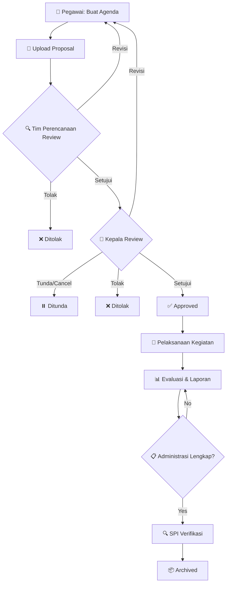

## Deskripsi Umum

**Tape Ketan** (Tata Kelola Kegiatan) adalah sistem pengelolaan agenda kegiatan yang terintegrasi, mencakup seluruh siklus dari perencanaan, approval workflow, pelaksanaan, hingga pelaporan dan evaluasi.

Sistem ini dirancang untuk memastikan setiap kegiatan memiliki:
- ✅ Perencanaan yang matang dan terdokumentasi
- ✅ Approval berjenjang (Tim Perencanaan → Kepala)
- ✅ Administrasi yang lengkap (anggota, peserta, tugas, dokumen)
- ✅ Monitoring dan evaluasi pasca kegiatan

---

## Alur Workflow



---

## Status dalam Sistem

### Approval Status (Status Persetujuan)

| Status | Label | Deskripsi |
|--------|-------|-----------|
| `draft` | **Draft** | Agenda baru dibuat, belum diajukan |
| `submitted` | **Menunggu Verifikasi Perencanaan** | Diajukan ke Tim Perencanaan |
| `approved_by_planning` | **Menunggu Approval Kepala** | Disetujui Tim Perencanaan, menunggu Kepala |
| `revision_required` | **Perlu Perbaikan (Perencanaan)** | Perlu revisi dari Tim Perencanaan |
| `revision_required_by_head` | **Perlu Perbaikan (Kepala)** | Perlu revisi dari Kepala |
| `approved` | **Disetujui** | Disetujui penuh, siap dilaksanakan |
| `pending` | **Ditunda/Cancel** | Ditunda atau dibatalkan oleh Kepala |
| `rejected` | **Ditolak** | Ditolak oleh Tim Perencanaan atau Kepala |

### Agenda Status (Status Pelaksanaan)

| Status | Label | Deskripsi |
|--------|-------|-----------|
| `draft` | **Draft** | Agenda masih dalam tahap perencanaan |
| `not_started` | **Belum Dimulai** | Approved tapi belum mulai |
| `in_progress` | **Sedang Berjalan** | Kegiatan sedang dilaksanakan |
| `report_preparation` | **Penyusunan Laporan** | Kegiatan selesai, sedang laporan |
| `archived` | **Arsip** | Kegiatan selesai dan diarsipkan |
| `cancel` | **Dibatalkan** | Kegiatan dibatalkan |

---

## Role dan Akses

| Role | Create | View | Edit | Approval | Archive |
|------|--------|------|------|----------|---------|
| **Pegawai** | ✅ | ✅ (milik sendiri) | ✅ (draft/revision) | ❌ | ❌ |
| **Tim Perencanaan** | ✅ | ✅ Semua | ✅ (anggaran) | ✅ Approval 1 | ❌ |
| **Kepala** | ✅ | ✅ Semua | ✅ (anggota) | ✅ Approval 2 | ❌ |
| **SPI** | ❌ | ✅ Semua | ❌ | ❌ | ✅ (jika lengkap) |

### Hak Akses Detail

#### Pegawai
- Membuat agenda baru
- Mengedit agenda sendiri (status draft/revision)
- Upload proposal dan dokumen
- Mengelola anggota, peserta, tugas
- Mengisi evaluasi

#### Tim Perencanaan
- Review proposal (approval 1)
- Edit anggaran dan klasifikasi program
- Upload dokumen telaah & KAK-RAB
- Action: Setujui, Perlu Perbaikan, Tolak

#### Kepala
- Review proposal (approval 2)
- Impact assessment (4 dimensi)
- Edit susunan keanggotaan
- Action: Setujui, Perlu Perbaikan, Tunda/Cancel, Tolak

#### SPI
- View-only access ke semua agenda
- Monitoring evaluasi kegiatan
- Akses dokumen dan laporan
- **Archive agenda** jika administrasi lengkap (dokumen, evaluasi, peserta)


---

## Struktur Menu Tape Ketan

```
Tape Ketan (/app/tape-ketan)
├── Daftar Agenda (Table)
├── Create Agenda
└── Detail Agenda
    ├── Info (ViewAgenda)
    ├── Anggota (ManageAgendaAnggota)
    ├── Tugas (ManageAgendaTugas)
    ├── Dokumen (ManageAgendaDokumen)
    ├── Evaluasi (ManageAgendaEvaluasi)
    ├── Anggaran (ManageAgendaAnggaran)
    └── Peserta (ManageAgendaPeserta)
```

### Menu Approval Terpisah

```
Approval Perencanaan (/app/approval-perencanaans)
└── Review Proposal (Tim Perencanaan)

Approval Kepala (/app/approval-kepalas)
└── Review Proposal (Kepala)
```

---

## Dokumen Wajib

### Saat Pengajuan (Draft → Submitted)
1. **Proposal** (Desain Kegiatan) - PDF, max 25MB

### Saat Approval Perencanaan (Submitted → ApprovedByPlanning)
1. **Dokumen Telaah** - PDF, max 25MB
2. **KAK & RAB** - PDF, max 25MB

### Saat Pelaksanaan (Approved)
1. **Dokumen Tugas** (variabel per jenis kegiatan)
2. **Daftar Hadir**
3. **Dokumentasi**
4. **SPJ Keuangan**

### Saat Evaluasi (Report Preparation)
1. **Laporan Kegiatan**
2. **Faktor Keberhasilan**
3. **Kendala & Solusi**

---

## Business Rules Penting

### Pengajuan Proposal
- Minimal 1 anggota panitia (selain creator)
- Upload dokumen proposal wajib
- Hanya bisa diajukan jika status `draft`, `revision_required`, atau `revision_required_by_head`

### Approval Perencanaan
- Hanya bisa approve jika status `submitted`
- Wajib upload Dokumen Telaah & KAK-RAB
- Dapat mengedit anggaran dan klasifikasi

### Approval Kepala
- Hanya bisa approve jika status `approved_by_planning`
- Wajib impact assessment (4 dimensi, scale 1-5)
- Dapat mengedit susunan keanggotaan

### Pelaksanaan
- Import peserta hanya tersedia jika `approval_status = approved`
- Upload dokumen tugas hanya untuk anggota agenda
- Dokumen Proposal, Telaah, KAK-RAB tidak bisa dihapus

### Evaluasi
- Hanya bisa diisi jika `approval_status = approved`
- Berisi faktor keberhasilan, kendala, dan solusi

---

## Notifikasi

Sistem mengirim notifikasi otomatis untuk event:
- ✅ Proposal diajukan
- ✅ Proposal disetujui (perencanaan/kepala)
- ✅ Perlu perbaikan
- ✅ Proposal ditolak
- ✅ Agenda ditunda/dibatalkan

Notifikasi dikirim via:
- [Telegram](https://t.me/+XadhwMvihb41NGRl)
- [Google Chat](https://chat.google.com/room/AAQAlw8CNk4?cls=7)

---

## File Storage

Semua dokumen disimpan di **S3 Storage** dengan struktur:
```
agenda/
├── dokumen/
│   ├── 2026/
│   └── review/
│       └── 2026/
```

### File Types & Size Limits
- **PDF**: Max 25MB (proposal, telaah, KAK-RAB)
- **Word/Excel**: Max 25MB (dokumen pendukung)
- **Link URL**: Tidak ada batasan ukuran


## Changelog
- **2026-02-27**: Guide book pertama kali dibuat
- **Slug**: `tape-ketan` (URL: `/app/tape-ketan`)
